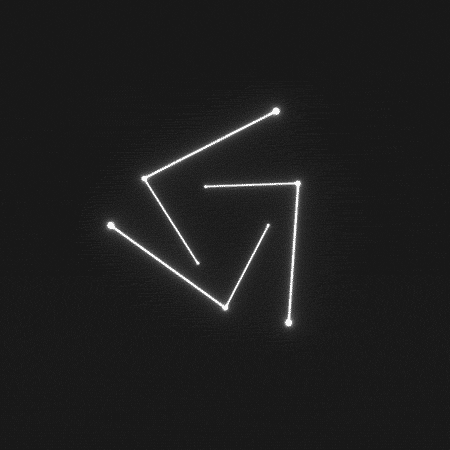
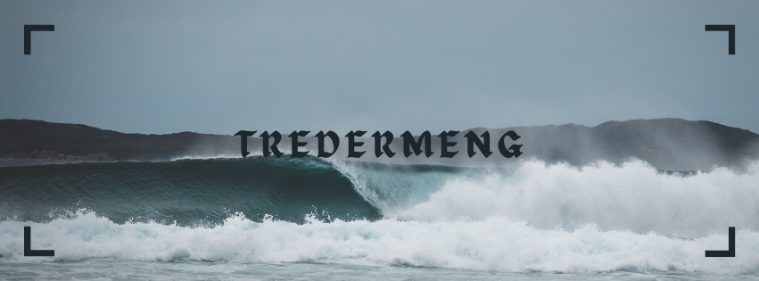

<h2> Hi, I'm Tredermeng</a></h2>

Hello! I'm an apprentice developer from Venezuela, but traveling around the world. I'm a lover of free software and a Linux enthusiast with my own environment. I focus on editing, development, and creating new and innovative things. I love music, landscapes, programming, editing, and continuously learning more. My main language is JavaScript. My general social media is @Tredermeng.

🛠️ **Stuffs I use (Languages,Tools and Others):**
  

  
